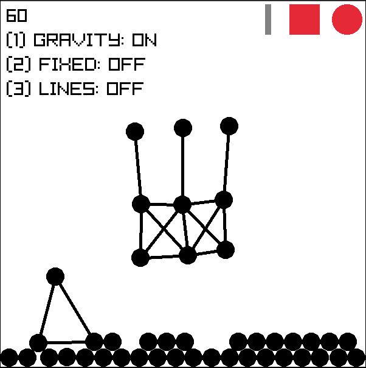

# Tiny physics on C

# Ussage
- Click either on the circle or the rectangle to select them.
- Click on the "canvas" to draw them.
- TODO: Right click to repeal them.
- The number of shapes on the screen appears on the top.

# About
- Made using raylib
